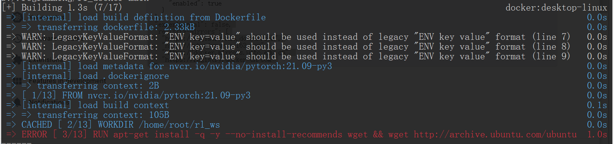
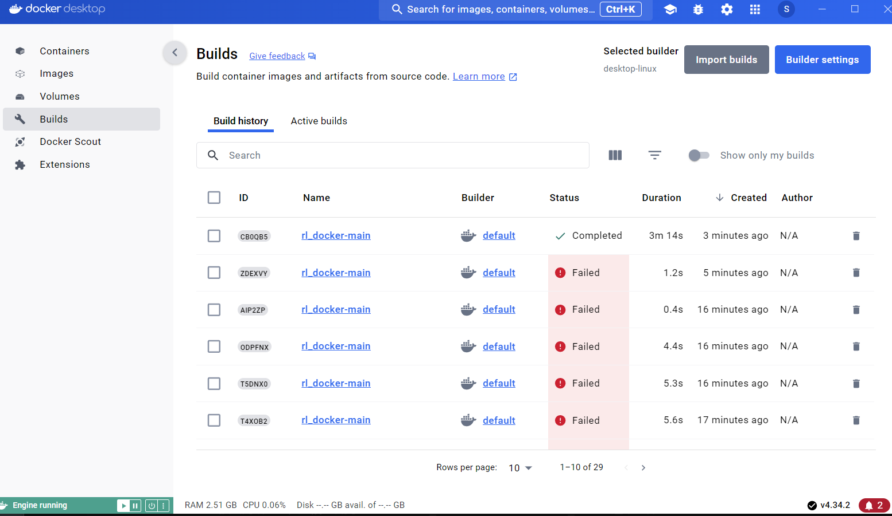
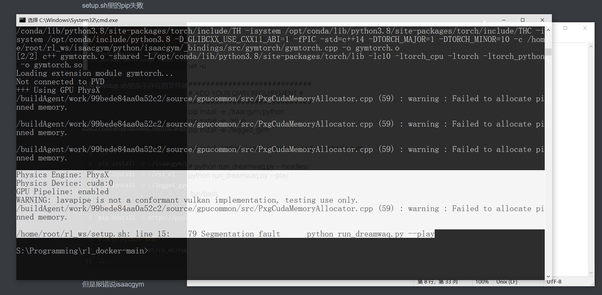

Job for docker.service failed because the control process exited with error code.
最后发现是之前用vim创建了个daemon.json 

[解决docker启动报错：Job for docker.service failed because the control process exited with error code-CSDN博客](https://blog.csdn.net/zwlww1/article/details/129624289#:~:text=提示：Job)

解决：

```shell
ubuntu:/etc/docker$ sudo rm daemon.json 
```
启动docker
```shell
 systemctl start docker
```
因为正常执行build大概率会因为网络问题翻车

<pre>[+] Building 0.3s (3/3) FINISHED                                                                
<font color="#3465A4"> =&gt; [internal] load .dockerignore                                                          0.0s</font>
<font color="#3465A4"> =&gt; =&gt; transferring context: 2B                                                            0.0s</font>
<font color="#3465A4"> =&gt; [internal] load build definition from Dockerfile                                       0.0s</font>
<font color="#3465A4"> =&gt; =&gt; transferring dockerfile: 2.33kB                                                     0.0s</font>
<font color="#CC0000"> =&gt; ERROR [internal] load metadata for nvcr.io/nvidia/pytorch:21.09-py3                    0.3s</font>
------
 &gt; [internal] load metadata for nvcr.io/nvidia/pytorch:21.09-py3:
------
Dockerfile:1
--------------------
   1 | &gt;&gt;&gt; FROM nvcr.io/nvidia/pytorch:21.09-py3
   2 |     
   3 |     # set WORKDIR
--------------------
ERROR: failed to solve: nvcr.io/nvidia/pytorch:21.09-py3: failed to do request: Head &quot;https://nvcr.io/v2/nvidia/pytorch/manifests/21.09-py3&quot;: read tcp 192.168.0.103:44150-&gt;54.148.129.60:443: read: connection reset by peer</pre>
所以先安装

[ERROR [internal\] load metadata for nvcr.io/nvidia/tensorrt:21.09-py3 · Issue #189 · ifzhang/ByteTrack (github.com)](https://github.com/ifzhang/ByteTrack/issues/189)

```sh
docker pull nvcr.io/nvidia/pytorch:21.09-py3 -–registry-mirror=https://mirror.iscas.ac.cn(国内镜像源地址)
```
启动docker
```
 vi  /etc/docker/daemon.json
```
重启docker
```
service docker restart
```
查看docker信息
```
docker info
```
清理docker builder
```sh
sudo docker builder prune
```
build
```sh
docker build --network host -t rl_docker-main -f S:/Programming/rl_docker-main/Dockerfile S:/Programming/rl_docker-main
```



出现这个错误是因为在构建 Docker 镜像时，网络连接到 `http://archive.ubuntu.com/ubuntu` 失败，但是不应该啊？

记事本打开 `Dockerfile` ，发现命令：

```sh
# replace mirror
RUN apt-get install -q -y --no-install-recommends wget \
&& wget http://archive.ubuntu.com/ubuntu/pool/main/c/ca-certificates/ca-certificates_20230311ubuntu0.20.04.1_all.deb \
...
```
于是我直接去网站上查，压根没看到`ca-certificates_20230311ubuntu0.20.04.1_all.deb`这个文件，已经过时被删除了

官网：[Index of /ubuntu/pool/main/c/ca-certificates](http://archive.ubuntu.com/ubuntu/pool/main/c/ca-certificates/)

阿里云：[ubuntu-pool-main-c-ca-certificates安装包下载_开源镜像站-阿里云 (aliyun.com)](http://mirrors.aliyun.com/ubuntu/pool/main/c/ca-certificates/?spm=a2c6h.25603864.0.0.644e1431A2R1g6)

替换为`ca-certificates_20240203~20.04.1_all.deb`版本后解决：

```sh
...
&& wget http://mirrors.aliyun.com/ubuntu/pool/main/c/ca-certificates/ca-certificates_20240203~20.04.1_all.deb \
&& dpkg -i ./ca-certificates_20240203~20.04.1_all.deb
...
```
完美解决



GPU不可用？
```apl
WARNING: The NVIDIA Driver was not detected.  GPU functionality will not be available.
```
build
```sh
docker build --network host -t rl_docker-main -f S:/Programming/rl_docker-main/Dockerfile S:/Programming/rl_docker-main
```
运行DreamWaQ

[docker的安装以及跑本地项目代码步骤说明_docker怎么运行本地代码-CSDN博客](https://blog.csdn.net/eye123456789/article/details/120879982#:~:text=为了在Win)

```sh
docker run -itd
```
WSL安装

[win11 安装 WSL2 在非 C 盘及配置（图形界面+代理）_wsl不安装在c盘 csdn-CSDN博客](https://blog.csdn.net/weixin_45840825/article/details/127138564)

```sh

```
docker run ，用docker命令运行run.sh（bash好难搞，曲线救国）
```sh
docker run -it --rm -v S:\Programming\rl_docker-main:/home/root/rl_ws --gpus=all --name=rl rl_docker-main bash /home/root/rl_ws/setup.sh
```
setup.sh里的pip失败


注释掉setup.sh里面不存在的文件就行，其实不是不存在，是要下载


[20231126-超详细Isaac Gym安装教程（基于双系统版本）-CSDN博客](https://blog.csdn.net/m0_37802038/article/details/134629194)

```sh
...
pip install -e ./isaacgym/python
pip install -e ./rsl_rl
pip install -e ./legged_gym

# 安装gym
pip install -i https://pypi.tuna.tsinghua.edu.cn/simple gym

# 执行 Python 脚本
python /home/root/rl_ws/run_dreamwaq.py --headless
...
```
最终结果



```sh
docker build --network host -t rl_docker-main -f S:/Programming/rl_docker-main/Dockerfile S:/Programming/rl_docker-main
```
build
```sh
docker build --network host -t rl_docker-main -f S:/Programming/rl_docker-main/Dockerfile S:/Programming/rl_docker-main
```
build
```sh
docker build --network host -t rl_docker-main -f S:/Programming/rl_docker-main/Dockerfile S:/Programming/rl_docker-main
```
build
```sh
docker build --network host -t rl_docker-main -f S:/Programming/rl_docker-main/Dockerfile S:/Programming/rl_docker-main
```
build
```sh
docker build --network host -t rl_docker-main -f S:/Programming/rl_docker-main/Dockerfile S:/Programming/rl_docker-main
```
build
```sh
docker build --network host -t rl_docker-main -f S:/Programming/rl_docker-main/Dockerfile S:/Programming/rl_docker-main
```